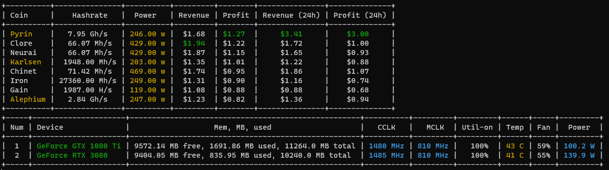

# Dog

```
Description
Dog checks every 5 seconds whether the miner is running (MAX_LOAD) and whether the temperature has exceeded the permissible level (MAX_TEMP)
```




1. cd Miner_tools
2. `pip install -r requirements.txt`
3. Add your constants to the `settings.py` file

   ```
   MAX_LOAD = 80
   MAX_TEMP = 60
   ELECTRICITY_COST = 0.07
   URL_hashrate_no = "https://hashrate.no/GPUcalculator?3080=1&1080ti=1"
   
   MINER_PATHS = {
       "Pyrin": r"G:\\Miner\\1.81\\Pyrin.bat",
       "Karlsen": r"G:\\Miner\\1.81\\Karlsen.bat",
       "Alephium":  r"G:\\Miner\\1.81\\Alephium.bat",
   }
   ```

4. Set absolute path for lolMiner.exe file

    ```
    @echo off
    %~dp0lolMiner.exe --algo KARLSEN --pool de.karlsen.herominers.com:1195 --user YOUR_KARLSEN_WALLET_ADDRESS.YOUR_WORKER_NAME --cclk 1200,1680 --coff 100,100 --mclk 810,810 --pl 200,250
    pause
    ```

5. cmd
    ```pycon
    python .\DoG.py
    ```
   
